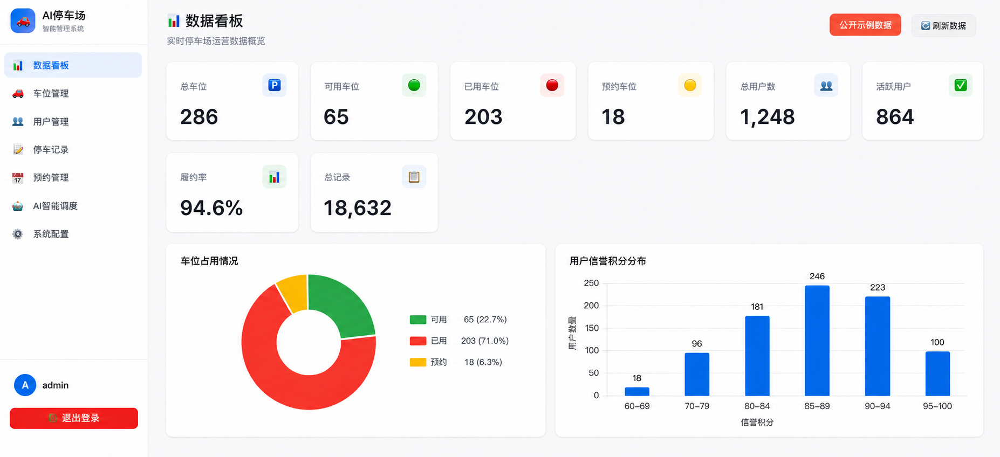

# 智能停车管理系统

[在线英文项目页](https://chenguoniuba-jpg.github.io/smart-parking-management/) · [一分钟操作视频](https://chenguoniuba-jpg.github.io/smart-parking-management/project-intro.html#walkthrough) · [v1.0.0 Release](https://github.com/chenguoniuba-jpg/smart-parking-management/releases/tag/v1.0.0) · [English](README.md) · [英文案例页](project-intro/README.md) · [复用与运维指南](REUSE.md)

> **两分钟项目入口：** [打开在线英文项目页 →](https://chenguoniuba-jpg.github.io/smart-parking-management/)

> **一分钟真实程序操作视频：** [在项目页中观看](https://chenguoniuba-jpg.github.io/smart-parking-management/project-intro.html#walkthrough)，或[直接打开 MP4](project-intro/assets/smart-parking-public-build-demo-60s.mp4)。视频录制自实际运行的公开版程序，使用隔离的公开示例数据库，不包含银行 Logo、现场身份、真实车牌或生产账号。

一个使用 FastAPI、SQLAlchemy、SQLite 和原生 JavaScript 构建的智能停车管理系统。系统于 2026 年 3 月在上海一处企业园区停车场开始实际使用，投入使用后继续迭代；当前仓库是 2026 年 8 月整理的公开复用版本。

## 仓库历史与发布来源

该系统的开发早于本 Git 仓库。项目在完成并准备公开发布时才引入 Git，因此仓库历史从 `v1.0.0` 公开发布快照开始，而不是从最初开发过程开始。1 月至 8 月的设计文件和更新日志属于回顾性的历史设计与迭代记录，不代表存在与之逐一对应的 Git 提交。公开发布之后的每次实际改动将使用当时的真实日期，通过正常提交和 Release 留痕。

> **Operational status and public-package boundary / 运行状态与公开版边界**
>
> - 系统于 2026 年 3 月开始在上海一处企业园区停车场使用，现场有 3 名管理员并管理 286 个车位；公开版中的应用模块均在现场使用。
> - 3 月投入使用后，系统在 4 月至 8 月继续迭代。截至当前公开快照，项目维护者确认当前公开应用源代码与当前现场应用源代码一致；这不表示 8 月版本在 3 月时已经以完全相同形态存在。
> - 企业名称、具体地址、账号凭据、个人信息、现场数据库和原始运营记录不公开。
> - 286 是经项目维护者确认的现场车位规模；公开初始化脚本保留相同总量，但使用示例编号和生成用户，不包含现场记录。
> - 实际使用情况可由该企业园区管理办公室确认。完整范围见 [Deployment statement](DEPLOYMENT.md)。
> - 流量功能是基于历史小时计数的确定性基线估计，不是训练后的机器学习模型。
> - 本公开仓库未附带上海现场身份信息、原始运营数据、标准化前后对比或性能基准材料。



图中的看板为**公开示例数据**：286 个车位对应已确认的现场规模，其他计数和比例用于展示界面，不作为上海现场实时运营统计发布。

一分钟视频依次展示登录、286 车位看板、车位列表、示例车辆查询、预约创建、规则流量基线、容量检查和系统配置。操作过程来自实际运行的公开版程序，视频中的业务记录均为公开示例记录。

## What it demonstrates

- 完整的停车场数据模型：用户、管理员、车位、停车记录、预约、积分与配置。
- JWT 管理员登录和受保护的管理 API。
- 车位尺寸、特殊需求和楼层偏好的可解释规则评分。
- 历史小时分布基线、长时停车提醒和容量阈值提示。
- FastAPI 自动 API 文档与原生 HTML/CSS/JavaScript 单页界面。
- bcrypt 密码哈希、环境变量密钥、受限 CORS 和自动化 API 测试。

## System boundary

```text
Browser SPA
    │  JWT-authenticated JSON requests
    ▼
FastAPI routers
    ├── authentication
    ├── users and parking spaces
    ├── records and reservations
    └── deterministic scheduling rules
    ▼
SQLAlchemy + SQLite
```

公开仓库未包含上海现场的相机、道闸、支付、车牌识别、凭据和实时业务数据接入配置。复用方应按自身场地完成威胁建模、审计日志、数据库迁移、备份、监控和硬件集成。

## 可复用工程材料

- `uv.lock` 锁定依赖，`.env.example` 列出非敏感配置项。
- `Dockerfile` 与 `compose.yaml` 提供容器启动、健康检查和 SQLite 持久化数据卷基线。
- `scripts/backup_sqlite.py` 使用 SQLite 备份接口生成并校验一致性备份。
- `scripts/check_public_package.py` 检查常见密钥文件、本地数据库、系统元数据和 Office 临时文件。
- 自动测试覆盖认证、车位分配、停车进出、预约、系统配置、历史基线和备份工具。
- `.github/workflows/pages.yml` 可发布 `project-intro/` 中的英文 GitHub Pages 页面。

具体部署边界、备份恢复和现场集成清单见 [复用与运维指南](REUSE.md)。这些材料提高了可复现性，但不会替代复用方自己的 TLS、集中监控、异地备份、数据库迁移、隐私合规和硬件集成。

## Quick start

需要 Python 3.9+ 和 [uv](https://docs.astral.sh/uv/)。

```bash
cp .env.example .env
uv sync --frozen --extra dev
```

初始化演示数据库：

```bash
uv run --env-file .env python -m backend.init_data
```

如果没有设置 `ADMIN_PASSWORD`，初始化脚本会在终端生成一次性管理员密码。也可以自行指定：

```bash
ADMIN_PASSWORD='choose-a-strong-password' uv run python -m backend.init_data
```

启动本地服务：

```bash
uv run --env-file .env python -m backend.main
```

- 应用界面：http://127.0.0.1:8000
- API 文档：http://127.0.0.1:8000/docs
- 健康检查：http://127.0.0.1:8000/health

开发模式未设置 `SECRET_KEY` 时会生成进程级临时密钥，重启后已有会话失效。生产模式必须显式设置强密钥：

```bash
APP_ENV=production SECRET_KEY='at-least-32-random-characters' uv run python -m backend.main
```

## Tests

```bash
uv run pytest
```

自动测试覆盖公开健康检查、接口鉴权、bcrypt 密码哈希、管理员创建、车位规则分配、停车进出、预约、系统配置、静态路由优先级、无历史数据时的确定性基线和 SQLite 备份。GitHub Actions 会在每次推送和拉取请求时运行这些测试与公开包检查。

`examples/` 中保留的是人工操作示例，不属于自动化测试，也不等同于现场运营日志。

## Interpreting the “smart” features

| Feature | Current implementation | What is not claimed |
|---|---|---|
| Traffic estimate | Counts historical entries by hour and reports a deterministic baseline | No trained ML model or validated forecast accuracy |
| Space assignment | Transparent score based on size, accessibility needs and floor | No optimization proof or site-specific travel-time calibration in the public package |
| Capacity prompt | Alerts when occupancy exceeds a configured threshold | No automated physical expansion |
| Long-stay alert | Compares stored monthly days with a threshold | No legal or policy enforcement decision |

## Project ownership and AI assistance

- Repository maintainer: [chenguoniuba-jpg](https://github.com/chenguoniuba-jpg)
- [维护者职责与归属说明](MAINTAINER_ROLE.md)只记录当前公开版能够支持的个人职责，不把干净发布快照误写成全部历史代码的个人作者证明。
- This public folder is a clean release snapshot; see [PUBLIC_RELEASE.md](PUBLIC_RELEASE.md).
- AI tools assisted with parts of documentation review and code refactoring. The repository maintainer remains responsible for verifying the code, claims and attribution before using the project in an application or publication.
- The seven Word files in `doc/product_mgt/` are design artifacts. The August v7 document records the current public-release iteration built on the July v6 baseline. These files can illustrate design thinking, but file names and metadata alone are not independent records of authorship, exact dates, Shanghai site details or measured outcomes.

## Documentation

- [复用与运维指南](REUSE.md)
- [Documentation index](doc/manual/INDEX.md)
- [Quick-start details](doc/manual/QUICKSTART.md)
- [Project structure](doc/manual/PROJECT_STRUCTURE.md)
- [Deployment statement](DEPLOYMENT.md)
- [Evidence and limitations](EVIDENCE_AND_LIMITATIONS.md)
- [Security policy](SECURITY.md)
- [Contributing](CONTRIBUTING.md)

Some files under `doc/manual/` preserve earlier requirements and design history. When a historical document conflicts with this README, this README and `EVIDENCE_AND_LIMITATIONS.md` define the current public claims.

## Version and license

Public release version: **1.0.0**

Licensed under the [MIT License](LICENSE). Public visibility permits downloading; the license provides the actual reuse permission and conditions.
